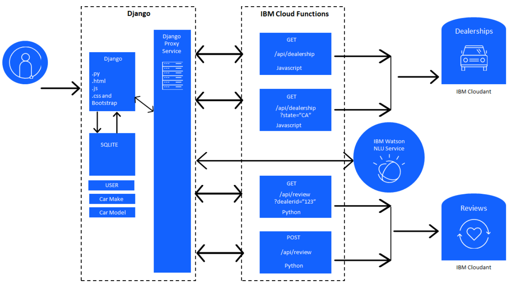

# Final Project Overview

The general idea is to build a website that allows users to select one of Best Car's dealerhips (a fictional company) in the US to view other users' reviews of the dealership's cars, as well as submit their own reviews. The site also needed basic functionality such as a navigation bar and static "about" and "contact" pages. The website had to be built with the Python-Django full stack web development framework and be deployed with Red Hat Openshift/Kubernetes on the IBM Cloud.

## Project Breakdown

**Prework: Sign up for IBM Cloud account and create a Watson Natural language Understanding service**
1. Create an IBM cloud account.
2. Create an instance of the Natural Language Understanding (NLU) service.(It is used in analyzing the tone of customer reviews and determine whether the review is positive, negative, or neutral.)

**Fork the project Github repository with a project then build and deploy the template project**
1. Fork the repository in my account
2. Clone the repository in the Theia lab environment
3. Create static pages to finish the user stories
4. Deploy the application on IBM Cloud

**Add user management to the application**
1. Implement user management using the Django user authentication system.
2. Set up continuous integration and delivery

**Implement backend services**
1. Create cloud functions to manage dealers and reviews
2. Create Django models and views to manage car model and car make
3. Create Django proxy services and views to integrate dealers, reviews, and cars together
 
**Add dynamic pages with Django templates**
1. Create a page that shows all the dealers
2. Create a page that shows reviews for a selected dealer
3. Create a page that lets the end user add a review for a selected dealer

**Containerize & deploy the application to Kubernetes**
1. Add deployment artifacts to the application
2. Deploy the application

#### Architecture

_Application architecture_

The dealership and review data is located in an IBM Cloudant database, while data about users and cars is in a simple SQLite database. In order to access data from IBM Cloudant, I wrote three IBM Cloud Functions which were accessible through an API. 

Each review is analysed by IBM Watson in order to display the review's general sentiment (negative, neutral, positive). 

#### Setup 
Clone the project:
- ```cd Car_Dealership_App/server```
Install the required Python packages
- ```python -m pip install -r requirements.txt```

Create a [new Django Secret Key](https://humberto.io/blog/tldr-generate-django-secret-key/) 

Run the development server: </br>
- ```python manage.py makemigrations djangoapp```
- ```python manage.py migrate djangoapp```
- ```python manage.py runserver```
- Go the website by adding `/djangoapp` to the end of the url

Create a new superuser:
- ```python manage.py createsuperuser```
- Log in via the admin site (just add `/admin` at the end of the url)

